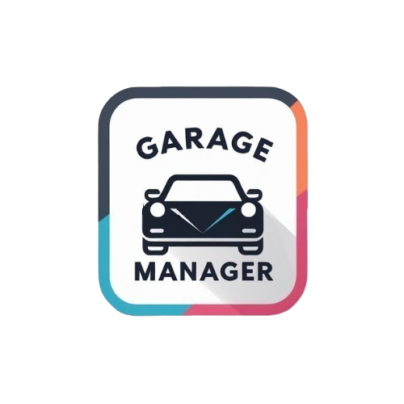

# GarageManager



## 🚗 O Projekcie

GarageManager to kompleksowy system do zarządzania warsztatem samochodowym. Pozwala na obsługę klientów, pojazdów, rezerwacji, napraw, faktur oraz automatycznych powiadomień. System jest przeznaczony zarówno dla właścicieli, pracowników, jak i klientów warsztatu.

## ✨ Kluczowe Funkcje

- Zarządzanie rezerwacjami i kalendarzem
- Obsługa pojazdów i historia napraw
- Baza klientów i komunikacja
- Inwentaryzacja części
- Fakturowanie i raportowanie
- Automatyczne powiadomienia (e-mail, push)
- Panel administracyjny i role użytkowników

## 🛠️ Technologie

**Backend:**

- **Python 3.x (Django, Django REST Framework)** - Framework Django został wybrany ze względu na jego wielowarstwową architekturę MVT, która idealnie sprawdza się w aplikacjach zarządzających danymi biznesowymi. Oferuje wbudowany panel administracyjny, który umożliwia właścicielom warsztatów łatwe zarządzanie danymi bez potrzeby tworzenia dodatkowych interfejsów. Django ORM znacząco upraszcza operacje bazodanowe, co jest kluczowe przy złożonej strukturze danych warsztatu (pojazdy, części, klienci, zlecenia). Django REST Framework rozszerza możliwości o pełne API RESTful z automatyczną walidacją danych, kontrolą dostępu opartą na rolach (kluczowe dla rozróżnienia mechaników, właścicieli i klientów) oraz wbudowaną dokumentacją API poprzez Swagger/OpenAPI.

- **PostgreSQL** - W kontekście warsztatu samochodowego, PostgreSQL oferuje kluczowe przewagi nad innymi bazami danych: obsługę złożonych relacji między encjami (np. powiązania między częściami, pojazdami i zleceniami), zaawansowane indeksowanie przyśpieszające wyszukiwanie w dużych katalogach części, transakcje ACID zapewniające spójność danych finansowych, oraz rozszerzenia PostGIS umożliwiające geoprzestrzenne zapytania (np. wyszukiwanie najbliższych warsztatów). Dodatkowym atutem są zaawansowane funkcje analityczne wykorzystywane w raportowaniu biznesowym dla właścicieli warsztatów oraz możliwość definiowania złożonych triggerów do automatycznego aktualizowania stanu magazynowego przy zużyciu części.

- **Celery, RabbitMQ (kolejki powiadomień)** - System warsztatowy wymaga przetwarzania wielu procesów w tle bez blokowania głównej aplikacji: powiadomienia klientów o statusie naprawy, automatyczne przypomnienia o wizytach, generowanie raportów dziennych/miesięcznych, synchronizacja z zewnętrznymi dostawcami części. Celery umożliwia równoległe wykonywanie tych zadań z różnymi priorytetami i harmonogramami, podczas gdy RabbitMQ jako broker zapewnia niezawodne kolejkowanie nawet przy awariach systemu. Implementacja ta gwarantuje, że np. powiadomienie SMS do klienta o gotowym do odbioru pojeździe zostanie wysłane nawet przy chwilowym przeciążeniu systemu, a raporty zostaną wygenerowane w godzinach zmniejszonego obciążenia.

**Frontend:**

- **React + TypeScript** - W interfejsie warsztatowym kluczowa jest responsywność i wydajność przy wielu jednoczesnych operacjach (np. mechanik przeglądający kilka zleceń, właściciel monitorujący statystyki). React z Virtual DOM zapewnia płynne odświeżanie tylko zmienionych elementów interfejsu, co jest szczególnie ważne przy dynamicznym śledzeniu statusu napraw. Komponentowa architektura React pozwala na stworzenie spójnego systemu UI z możliwością ponownego wykorzystania elementów (formularze rezerwacji, karty pojazdów, harmonogramy). TypeScript zapobiega typowym błędom w obsłudze danych warsztatowych (np. pomylenie identyfikatorów części, błędne obliczenia kosztów naprawy) poprzez statyczne typowanie, znacząco redukując liczbę błędów w produkcji. Ułatwia też implementację złożonych formularzy z walidacją biznesową (np. sprawdzanie kompatybilności części z modelem pojazdu).

- **Material UI** - Warsztaty samochodowe często korzystają z aplikacji w trudnych warunkach (tablety w warsztacie, różne urządzenia klientów), wymagając intuicyjnego i czytelnego interfejsu. Material UI oferuje gotowe komponenty z przemyślanym UX, zapewniające spójne doświadczenie na różnych urządzeniach. Zaimplementowane w nim wzorce dostępności (WCAG) są istotne dla szerokiego grona użytkowników, w tym osób starszych często korzystających z usług warsztatowych. Zestaw komponentów Material UI (tabele danych, kalendarze, selektory) idealnie odpowiada na potrzeby aplikacji warsztatowej - od zarządzania harmonogramem napraw po przeglądanie katalogu części. Jego wbudowane motywy umożliwiają też łatwe dostosowanie wyglądu do identyfikacji wizualnej konkretnego warsztatu.

- **Vite** - Szybki cykl rozwoju jest kluczowy przy adaptacji systemu do zmieniających się potrzeb biznesu warsztatowego. Vite wykorzystuje natywne moduły ES zamiast budowania bundle'a podczas developmentu, co przekłada się na błyskawiczny start serwera (poniżej 300ms vs. kilkanaście sekund w Webpack). Dla developerów pracujących nad systemem warsztatowym oznacza to natychmiastowe testowanie zmian w interfejsie. Mechanizm HMR (Hot Module Replacement) Vite aktualizuje tylko zmienione komponenty bez odświeżania całej aplikacji, co pozwala zachować stan (np. wypełnione formularze diagnostyczne czy koszyk części) podczas wprowadzania poprawek. Optymalizacja produkcyjna z podziałem kodu (code splitting) zapewnia szybkie ładowanie aplikacji nawet na słabszych urządzeniach warsztatowych.

## 📋 Wymagania

- Node.js 16+
- Python 3.8+
- PostgreSQL 13+
- RabbitMQ 3.x

## 🚀 Instalacja

### Backend

```powershell
# Klonowanie repozytorium
git clone https://github.com/username/GarageManager.git
cd GarageManager/backend

# Wirtualne środowisko
python -m venv venv
.\venv\Scripts\activate

# Instalacja zależności
pip install -r requirements.txt

# Migracje bazy danych
python manage.py migrate

# Uruchomienie serwera
python manage.py runserver

# Worker powiadomień (osobny terminal)
python notifications/notification_worker.py
```

### Frontend

```powershell
cd ../frontend
npm install
npm run dev
```

## 👥 Role Użytkowników

- **Administrator** – pełna kontrola
- **Właściciel** – zarządzanie warsztatem
- **Mechanik** – obsługa napraw
- **Klient** – rezerwacje i historia pojazdu

## 🔄 Architektura

- **Frontend** – React/TypeScript
- **Backend API** – Django REST
- **Powiadomienia** – Celery + RabbitMQ

## 🤝 Wkład

Chcesz pomóc? Otwórz Pull Request lub zgłoś Issue!

## 📄 Licencja

MIT License

---

© 2025 GarageManager. Wszelkie prawa zastrzeżone.
